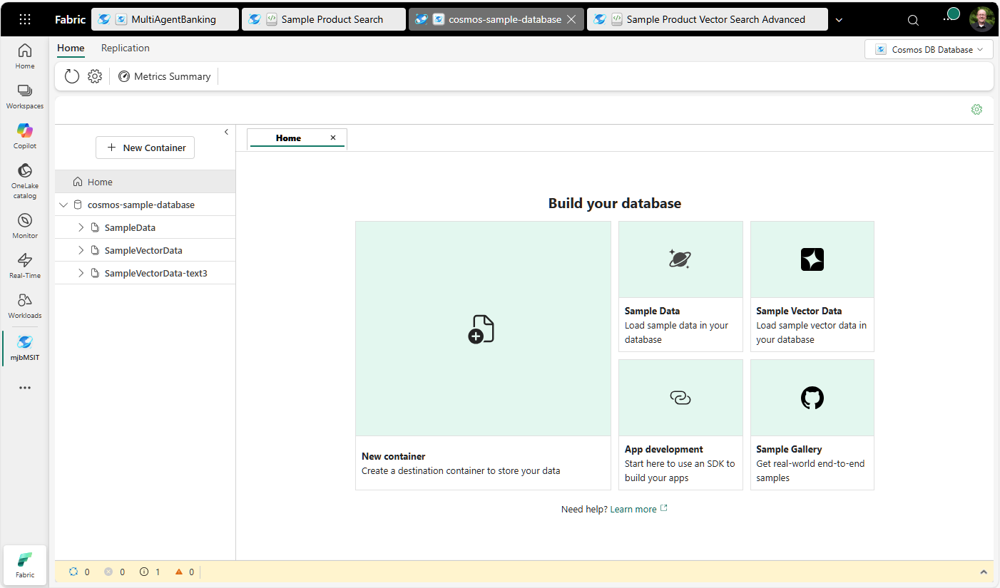

# Cosmos DB in Fabric - Samples Repository

Welcome to the **Cosmos DB in Fabric Samples Repository**! 🌟

This repository serves as your comprehensive hub for learning and exploring Cosmos DB in Microsoft Fabric through practical, real-world samples. Whether you're just getting started or looking to implement advanced scenarios, you'll find code samples, datasets, and notebooks to accelerate your development journey.

*The Cosmos DB in Fabric Data Explorer - where many of these samples begin*

## 🚀 Quick Start

New to Cosmos DB in Fabric? Start here:

1. **Create a Cosmos DB artifact** in your Fabric workspace
2. **Load sample data** using the Data Explorer (click "SampleData" on the Home screen)
3. **Explore the samples** in this repository to learn key concepts and patterns

## 📚 Documentation & Resources

- [📖 Cosmos DB in Fabric Documentation](https://docs.microsoft.com/fabric/database/cosmos-db/overview)
- [🎯 Getting Started Guide](https://docs.microsoft.com/fabric/database/cosmos-db/quickstart-portal)
- [⚡ Performance Best Practices for Python](https://docs.microsoft.com/azure/cosmos-db/nosql/best-practice-python)
- [💡 Design Patterns](https://docs.microsoft.com/azure/cosmos-db/modeling-data)
- [🔧 Cosmos Python API Reference](https://docs.microsoft.com/python/api/azure-cosmos/)

## 📋 Samples

| Sample | Description | Prerequisites | Difficulty |
|--------|-------------|---------------|------------|
| [Simple Query](./simple-query/) | Basic CRUD operations and queries using the sample dataset | SampleData container | Beginner |
| [User Data Functions](./user-data-functions/) | Complete collection of Cosmos DB operations using Fabric User Data Functions | SampleData container, User Data Functions enabled | Intermediate |
| [Vector Search](./vector-search/) | AI-powered semantic search using OpenAI embeddings and VectorDistance | SampleVectorData container | Intermediate |
| [Spark Analytics & Power BI](./spark-analytics-powerbi/) | Price-review correlation analysis using Spark SQL with Power BI dashboards | Cosmos DB with lakehouse shortcuts | Advanced |
| [Advanced Vector Search](./vector-search-advanced/) | Enterprise-grade vector search with Azure OpenAI deployment, Key Vault integration, and custom embedding models | Azure subscription owner rights, Workspace Identity | Expert |
| [Management Operations](./management/) | Container management, throughput operations, and robust data loading with retry logic | Empty Cosmos DB artifact | Advanced |

### 📊 Datasets

| Dataset | Description | Use Case |
|---------|-------------|----------|
| [fabricSampleData.json](./datasets/fabricSampleData.json) | Product catalog with customer reviews | Basic queries and operations |
| [fabricSampleDataVectors-ada-002-1536.json](./datasets/fabricSampleDataVectors-ada-002-1536.json) | Sample data with Ada-002 embeddings (1536 dimensions) | Vector search scenarios |
| [fabricSampleDataVectors-3-large-512.json](./datasets/fabricSampleDataVectors-3-large-512.json) | Sample data with text-embedding-3-large vectors (512 dimensions) | Advanced vector operations with Azure OpenAI |

### 🎯 Coming Soon

- **Advanced Query Patterns** - Complex queries, aggregations, and joins
- **Hybrid Search Samples** - Combining vector and traditional search patterns  
- **Real-time Analytics** - Stream processing and change feed examples
- **Multi-region Scenarios** - Global distribution and consistency patterns
- **Integration Samples** - Connecting with other Fabric services

## 🛠️ Prerequisites

Before running the samples, ensure you have:

- **Microsoft Fabric workspace**
- **Python 3.8+** for notebook samples
- **Azure Cosmos SDK** (`pip install azure-cosmos`)
- **Sample data loaded** in your Cosmos DB container (use Data Explorer)

## 💡 Sample Categories

### 🟢 Beginner

Perfect for those new to Cosmos DB in Fabric

- Basic authentication and connection
- Simple CRUD operations
- Query fundamentals

### 🟡 Intermediate

For developers with some Cosmos DB experience

- Advanced querying techniques
- Data modeling patterns
- AI integration with vector search
- SQL Analytics and Business Intelligence

### 🔴 Advanced

Complex scenarios and production patterns

- Container management and lifecycle operations
- Performance optimization and retry logic
- Custom indexing strategies

### ⚫ Expert

Enterprise-grade implementations requiring significant Azure permissions

- Multi-service Azure deployments
- Advanced security patterns with Key Vault
- Custom embedding models and optimizations

## 🤝 How to Use This Repository

1. **Browse the samples** using the table of contents above
2. **Clone or download** the repository to your local machine
3. **Follow the README** in each sample folder for specific instructions
4. **Load the datasets** using Cosmos DB Data Explorer in Fabric
5. **Run the notebooks** in your Fabric workspace or local Jupyter environment

## 🆘 Need Help?

- 📖 Check the [documentation links](#-documentation--resources) above
- 🐛 Report issues using [GitHub Issues](../../issues)
- 💬 Ask questions in [GitHub Discussions](../../discussions)
- 📧 See [SUPPORT.md](./SUPPORT.md) for additional support options

## Contributing

This project welcomes contributions and suggestions.  Most contributions require you to agree to a
Contributor License Agreement (CLA) declaring that you have the right to, and actually do, grant us
the rights to use your contribution. For details, visit [Contributor License Agreements](https://cla.opensource.microsoft.com).

When you submit a pull request, a CLA bot will automatically determine whether you need to provide
a CLA and decorate the PR appropriately (e.g., status check, comment). Simply follow the instructions
provided by the bot. You will only need to do this once across all repos using our CLA.

This project has adopted the [Microsoft Open Source Code of Conduct](https://opensource.microsoft.com/codeofconduct/).
For more information see the [Code of Conduct FAQ](https://opensource.microsoft.com/codeofconduct/faq/) or
contact [opencode@microsoft.com](mailto:opencode@microsoft.com) with any additional questions or comments.

## Trademarks

This project may contain trademarks or logos for projects, products, or services. Authorized use of Microsoft
trademarks or logos is subject to and must follow
[Microsoft's Trademark & Brand Guidelines](https://www.microsoft.com/legal/intellectualproperty/trademarks/usage/general).
Use of Microsoft trademarks or logos in modified versions of this project must not cause confusion or imply Microsoft sponsorship.
Any use of third-party trademarks or logos are subject to those third-party's policies.
