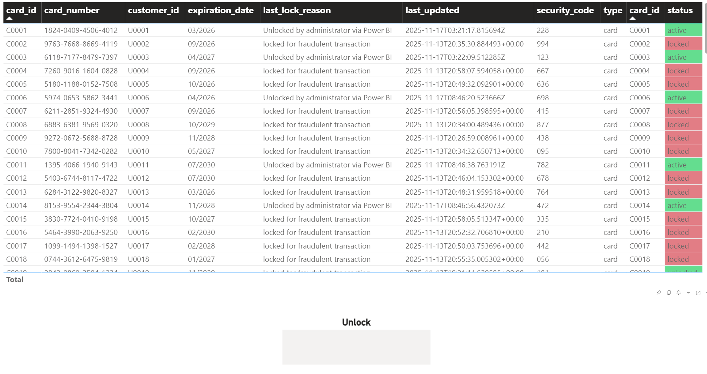

<!--
---
page_type: sample
languages:
- python
products:
- fabric
- fabric-database-cosmos-db
name: |
    Real-Time Credit Card Fraud Detection with Vector Search
urlFragment: fraud-detection
description: Detect fraudulent credit card transactions in real-time using Azure Cosmos DB vector search, change feed streaming, and anomaly detection with embeddings.
---
-->

# 🔐 Real-Time Credit Card Fraud Detection with Vector Search

Detect anomalous credit card transactions in real-time using vector embeddings, change feed streaming, and statistical anomaly detection

This sample demonstrates an end-to-end fraud detection system using **Azure Cosmos DB in Microsoft Fabric** with **vector search capabilities**, **change feed streaming**, and **OpenAI embeddings**. The system analyzes transaction patterns by combining merchant, location, and amount signals into semantic vectors, then detects anomalies by comparing new transactions against historical spending patterns using vector similarity.



> **🎯 Key Innovation**: This sample uses **vector-based anomaly detection** with **card-scoped historical patterns** and **dynamic thresholds**, avoiding static rules by learning each card's unique spending behavior through semantic embeddings.

## 🎯 What You'll Learn

### 🔒 **Fraud Detection Concepts**

- **Vector-based anomaly detection** using transaction embeddings
- **Real-time streaming** with Cosmos DB change feed and Spark Structured Streaming
- **Statistical outlier detection** using centroid distance and dynamic thresholds
- **Card-scoped analysis** partitioned by credit card for efficient queries
- **Automatic card locking** when fraudulent transactions are detected

### 🔗 **Fabric Integration Patterns**

- **Cosmos DB vector indexing** with DiskANN for high-performance similarity search
- **Change feed streaming** to process new transactions in real-time
- **Spark connector** for Cosmos DB with Azure AD authentication
- **OpenAI embeddings** integration for semantic feature representation

### 🧠 **Machine Learning & Analytics**

- **Embedding generation** combining categorical and numerical features
- **Weighted feature combination** (amount, merchant, location)
- **L2 normalization** and cosine similarity for vector comparison
- **Centroid-based anomaly scoring** with adaptive thresholds
- **Pearson correlation** for transaction pattern analysis

## 📋 Prerequisites

### **Required Services**

- **Microsoft Fabric workspace** with appropriate permissions
- **Cosmos DB artifact** in Fabric with vector search enabled
- **Fabric Capacity** for OpenAI embedding generation (billed against your capacity)
- **Spark Environment** with required Spark libraries

### **Container Requirements**

You'll need **three containers** in your Cosmos DB database:

1. **CCTransactions** - Stores historical credit card transactions with vector embeddings
   - Partition key: `/card_id`
   - Vector index configuration:

     ```json
     {
       "path": "/embedding",
       "type": "DiskANN",
       "dimensions": 1536,
       "metric": "cosine",
       "quantizationByteSize": 4,
       "indexingSearchListSize": 128,
       "vectorIndexShardKey": ["/card_id"]
     }
     ```

   - Data type: float32 arrays

2. **CreditCards** - Stores credit card details and lock status
   - Partition key: `/customer_id`
   - Fields: card_id, customer_id, card_number, status, last_lock_reason, last_updated

3. **PendingCCTransactions** - Stores pending transactions for stream processing
   - Partition key: `/card_id`
   - Used as the change feed source for real-time fraud detection

### **Environment Setup**

Create a **Spark Environment** with the following JAR libraries:

- [azure-cosmos-spark_3-5_2-12-4.41.0.jar](https://repo1.maven.org/maven2/com/azure/cosmos/spark/azure-cosmos-spark_3-5_2-12/4.41.0/azure-cosmos-spark_3-5_2-12-4.41.0.jar)
- [fabric-cosmos-spark-auth_3-1.1.0.jar](https://repo1.maven.org/maven2/com/azure/cosmos/spark/fabric-cosmos-spark-auth_3/1.1.0/fabric-cosmos-spark-auth_3-1.1.0.jar)

### **Skills**

- Basic Python knowledge
- Understanding of credit card transactions
- Familiarity with vector embeddings (helpful but not required)
- Basic understanding of streaming data concepts

## 🚀 Getting Started

### Step 1: Create Cosmos DB Database and Containers

1. **Create a new Cosmos DB artifact** in your Microsoft Fabric workspace:
   - In your workspace, create a **new Cosmos DB artifact**
   - Name your artifact (e.g., `FraudDetectionDB`)

2. **Create three containers** using Data Explorer:

   **Container 1: CCTransactions**
   - Click **New Container**
   - Container name: `CCTransactions`
   - Partition key: `/card_id`
   - Click **Create**
   - **Configure vector index**:
     - In the container settings, navigate to **Indexing Policy**
     - Add a vector index for the `/embedding` path with the following settings:
       - **Path**: `/embedding`
       - **Type**: `DiskANN`
       - **Dimensions**: `1536`
       - **Metric**: `cosine`
       - **Quantization Byte Size**: `4`
       - **Indexing Search List Size**: `128`
       - **Vector Index Shard Key**: `/card_id`

   **Container 2: CreditCards**
   - Click **New Container**
   - Container name: `CreditCards`
   - Partition key: `/customer_id`
   - Click **Create**

   **Container 3: PendingCCTransactions**
   - Click **New Container**
   - Container name: `PendingCCTransactions`
   - Partition key: `/card_id`
   - Click **Create**

### Step 2: Create Spark Environment

1. **Create a new Spark Environment** in your Fabric workspace
2. **Add required libraries**:
   - Navigate to **Libraries** tab
   - Upload or link the two JAR files listed in Prerequisites
   - Wait for the environment to be ready
3. **Note the environment name** for use in the notebooks

### Step 3: Import and Configure Notebooks

> **🚨 IMPORTANT**: These notebooks MUST be run in Microsoft Fabric - they cannot be executed locally due to Fabric-specific authentication and Spark streaming features.

> **💡 NOTE**: OpenAI embedding generation is built into the Fabric platform and will be billed against your Fabric Capacity. No external OpenAI service or API keys are required.

**Download the notebooks:**

1. Navigate to the `fraud-detection` folder in this repository
2. Download all three notebooks:
   - `1-data-generator.ipynb` - Generate synthetic transaction data
   - `2-fraud-detection.ipynb` - Real-time fraud detection engine
   - `3-new-transactions.ipynb` - Add pending transactions for testing

**Import into Fabric:**

1. In your Fabric workspace, select **Import → Notebook**
2. Upload each notebook individually
3. Attach your Spark Environment to each notebook

**Configure the notebooks:**

Update the configuration values in **all three notebooks**:

```python
COSMOS_ENDPOINT = '<your-cosmos-endpoint>'  # From Cosmos DB artifact settings
COSMOS_DATABASE_NAME = '<your-database-name>'  # Your Cosmos DB artifact name
```

The OpenAI configuration is already set up to use Fabric's built-in OpenAI service - no additional configuration needed!

### Step 4: Run the Sample

Execute the notebooks in sequence:

#### Part 1: Generate Initial Transaction Data (1-data-generator.ipynb)

1. Open `1-data-generator.ipynb`
2. Update configuration values (Cosmos endpoint, database name, OpenAI settings)
3. Execute all cells to:
   - Create 100 synthetic customers (U0001-U0100)
   - Generate credit cards for each customer (C0001-C0100)
   - Generate 60-100 historical transactions per card with embeddings
   - Populate CCTransactions and CreditCards containers
4. **Expected runtime**: 15-30 minutes (depending on OpenAI API rate limits)
5. **Result**: ~7,000-10,000 historical transactions with vector embeddings

#### Part 2: Start Real-Time Fraud Detection (2-fraud-detection.ipynb)

1. Open `2-fraud-detection.ipynb`
2. Update configuration values to match Part 1
3. Review the fraud detection logic explanation
4. Execute cells up to the streaming query start
5. **Run the fraud detection stream**:
   - The notebook will start a Spark Structured Streaming query
   - It monitors the PendingCCTransactions container via change feed
   - Processes each new transaction through the fraud detection algorithm
   - Automatically locks cards when fraud is detected
6. **Leave this notebook running** - it will process transactions in real-time

#### Part 3: Test with New Transactions (3-new-transactions.ipynb)

1. Open `3-new-transactions.ipynb` (while Part 2 is still running)
2. Update configuration values to match Parts 1 and 2
3. Choose one of the test patterns:
   - **Continuous testing**: Run the loop that generates 5 transactions every 60 seconds
   - **Manual testing**: Use the manual cell to insert specific transactions
4. **Watch the fraud detection in action**:
   - Check the output in `2-fraud-detection.ipynb` for fraud alerts
   - Query CreditCards container to see locked cards
   - Observe how the system distinguishes normal vs anomalous transactions

## 📊 Data Model and Architecture

### **Document Structures**

#### CCTransactions (Historical Transactions)

```json
{
  "id": "uuid",
  "type": "transaction",
  "card_id": "C0001",
  "customer_id": "U0001",
  "merchant": "Starbucks",
  "location": "California",
  "amount": 15.75,
  "embedding": [0.123, -0.456, ...],  // 1536-dimensional vector
  "timestamp": "2025-11-13T10:30:00Z"
}
```

#### CreditCards

```json
{
  "id": "C0001",
  "type": "card",
  "card_id": "C0001",
  "customer_id": "U0001",
  "card_number": "1234-5678-9012-3456",
  "security_code": "123",
  "expiration_date": "12/2028",
  "status": "unlocked",  // or "locked"
  "last_lock_reason": "locked for fraudulent transaction",
  "last_updated": "2025-11-13T10:45:00Z",
  "createdAt": "2025-11-01T00:00:00Z"
}
```

#### PendingCCTransactions (Stream Input)

```json
{
  "id": "uuid",
  "type": "transaction",
  "card_id": "C0001",
  "customer_id": "U0001",
  "merchant": "Samsung",
  "location": "Rhode Island",
  "amount": 1800.00,
  "timestamp": "2025-11-13T11:00:00Z"
}
```

### **Architecture Flow**

```text
┌─────────────────────────────────────────────────────────────────┐
│                   1. Data Generation Phase                      │
│  (1-data-generator.ipynb)                                       │
│                                                                 │
│  • Generate 100 customers & cards                               │
│  • Create realistic transaction patterns per merchant profile   │
│  • Generate embeddings (merchant + location + amount)           │
│  • Store in CCTransactions with vector index                    │
│  • Store cards in CreditCards container                         │
└─────────────────────────────────────────────────────────────────┘
                              ↓
┌─────────────────────────────────────────────────────────────────┐
│              2. Real-Time Fraud Detection Engine                │
│  (2-fraud-detection.ipynb - Spark Streaming)                    │
│                                                                 │
│  ┌─────────────────┐    Change Feed     ┌──────────────────┐    │
│  │ Pending         │ ──────────────────→│ Spark Structured │    │
│  │ Transactions    │                    │ Streaming Query  │    │
│  └─────────────────┘                    └──────────────────┘    │
│                                                   ↓             │
│                                          Fraud Detection        │
│                                          Algorithm              │
│                                                   ↓             │
│                              ┌─────────────────────────────┐    │
│                              │ Is Card Already Locked?     │    │
│                              └─────────────────────────────┘    │
│                                     ↓            ↓              │
│                                   Yes           No              │
│                                     ↓            ↓              │
│                                  Skip      Vector Search        │
│                                            (TOP-K neighbors)    │
│                                                   ↓             │
│                              ┌─────────────────────────────┐    │
│                              │ Calculate Anomaly Score     │    │
│                              │ (Distance from Centroid)    │    │
│                              └─────────────────────────────┘    │
│                                     ↓            ↓              │
│                                 Fraud?      Normal?             │
│                                     ↓            ↓              │
│                       ┌──────────────────┐  ┌───────────────┐   │
│                       │ Lock Card        │  │ Add to        │   │
│                       │ (PATCH operation)│  │ CCTransactions│   │
│                       └──────────────────┘  └───────────────┘   │
└─────────────────────────────────────────────────────────────────┘
                              ↑
┌─────────────────────────────────────────────────────────────────┐
│              3. Test Transaction Injection                      │
│  (3-new-transactions.ipynb)                                     │
│                                                                 │
│  • Generate new pending transactions                            │
│  • Insert into PendingCCTransactions container                  │
│  • Trigger change feed → fraud detection processing             │
└─────────────────────────────────────────────────────────────────┘
```

## 🧠 Fraud Detection Algorithm Deep Dive

### **How Vector-Based Anomaly Detection Works**

The fraud detection system uses a sophisticated statistical approach that learns each card's unique spending patterns:

#### **Step 1: Embedding Generation**

Each transaction is converted into a **1536-dimensional vector** that combines:

```python
# Weighted combination of features
W_AMOUNT   = 0.2  # Transaction amount (normalized)
W_MERCHANT = 0.3  # Merchant category embedding
W_LOCATION = 0.5  # Geographic location embedding

# Final embedding = L2_normalized([amount_scaled, merchant_emb, location_emb])
```

**Why this matters:**

- **Merchant embeddings** capture semantic similarity (Starbucks ≈ Dunkin', Apple Store ≈ Microsoft)
- **Location embeddings** detect geographic anomalies (home state vs international)
- **Amount normalization** uses per-merchant typical ranges to avoid false positives

#### **Step 2: Historical Pattern Retrieval**

For each new transaction, the system queries the **TOP-K nearest neighbors** using vector similarity:

```sql
SELECT TOP @k c.embedding, c.amount, c.timestamp
FROM c
WHERE c.card_id = @card
  AND c.type = 'transaction'
ORDER BY VectorDistance(c.embedding, @new_embedding)
```

**Key optimizations:**

- **Partition-scoped query** (card_id) for low latency
- **DiskANN index** for fast approximate nearest neighbor search
- **No merchant restriction** - learns cross-merchant patterns

#### **Step 3: Statistical Anomaly Scoring**

The algorithm uses **centroid-based distance** with **dynamic thresholds**:

```text
1. Calculate centroid of historical embeddings:
   centroid = mean(all_neighbor_embeddings)

2. Compute distances from each neighbor to centroid:
   d_i = ||neighbor_i - centroid||₂

3. Calculate dynamic threshold:
   threshold = mean(d_i) + (multiplier × std_dev(d_i))
   Default multiplier = 2.5 (adjust for sensitivity)

4. Score new transaction:
   new_distance = ||new_embedding - centroid||₂

5. Fraud decision:
   is_fraud = (new_distance > threshold)
```

**Mathematical formulas:**

**Centroid Calculation:**
$$
\text{centroid} = \frac{1}{N} \sum_{i=1}^{N} \mathbf{x}_i
$$

**Distance for Each Neighbor:**
$$
d_i = \|\mathbf{x}_i - \text{centroid}\|_2
$$

**Threshold Formula:**
$$
\text{threshold} = \mu_d + (k \times \sigma_d)
$$

**Fraud Decision Rule:**
$$
\|\mathbf{x}_{\text{new}} - \text{centroid}\|_2 > \text{threshold}
$$

Where:

- **N** = number of historical transactions (TOP-K neighbors)
- **x_i** = embedding vector for historical transaction i
- **μ_d** = mean distance from centroid
- **σ_d** = standard deviation of distances
- **k** = multiplier (default 2.5, represents ~98.8% confidence interval)

**Why this works:**

- **Adaptive per-card** - each card has its own spending centroid
- **Robust to outliers** - uses percentiles for amount normalization
- **Statistical confidence** - multiplier controls false positive rate
- **No cold-start issues** - uses provisional bands for new cards

#### **Step 4: Automatic Card Locking**

When fraud is detected:

```python
# Patch CreditCards container
patch_operations = [
    {"op": "set", "path": "/status", "value": "locked"},
    {"op": "set", "path": "/last_lock_reason", "value": "locked for fraudulent transaction"},
    {"op": "set", "path": "/last_updated", "value": current_timestamp}
]
```

**Subsequent transactions** for locked cards are automatically rejected without fraud analysis.

### **Tuning Parameters**

Adjust these values in `2-fraud-detection.ipynb` to control sensitivity:

| Parameter | Default | Effect | When to Increase | When to Decrease |
|-----------|---------|--------|------------------|------------------|
| `k_neighbors` | 50 | Number of historical transactions | More data available | Faster queries needed |
| `multiplier` | 2.5 | Threshold strictness | Too many false positives | Missing actual fraud |
| `home_prob` | 0.85 | Home state likelihood | More local spending | More travel expected |

## 🔍 Key Features and Queries

### **1. Check Card Lock Status**

```python
# Query CreditCards for locked cards
query = """
    SELECT c.card_id, c.status, c.last_lock_reason, c.last_updated
    FROM c
    WHERE c.status = 'locked'
"""
locked_cards = list(cards_container.query_items(query=query, enable_cross_partition_query=True))
print(f"Found {len(locked_cards)} locked cards")
```

### **2. Analyze Historical Transaction Patterns**

```python
# Get transaction distribution for a specific card
query = """
    SELECT c.merchant, c.location, c.amount
    FROM c
    WHERE c.card_id = @card AND c.type = 'transaction'
    ORDER BY c.timestamp DESC
"""
params = [{"name": "@card", "value": "C0001"}]
transactions = list(txns_container.query_items(
    query=query,
    parameters=params,
    partition_key="C0001"
))
```

### **3. Find Similar Transactions (Vector Search)**

```python
# Find transactions similar to a given embedding
query = """
    SELECT TOP 10 c.merchant, c.location, c.amount, c.timestamp
    FROM c
    WHERE c.card_id = @card AND c.type = 'transaction'
    ORDER BY VectorDistance(c.embedding, @embedding)
"""
params = [
    {"name": "@card", "value": "C0001"},
    {"name": "@embedding", "value": new_transaction_embedding}
]
similar = list(txns_container.query_items(
    query=query,
    parameters=params,
    partition_key="C0001"
))
```

### **4. Monitor Fraud Detection Performance**

```python
# Count fraud detections by merchant
query = """
    SELECT c.merchant, COUNT(1) as fraud_count
    FROM c
    WHERE c.type = 'transaction'
    GROUP BY c.merchant
    ORDER BY fraud_count DESC
"""
fraud_stats = list(txns_container.query_items(query=query, enable_cross_partition_query=True))
```

## 🔄 Testing Fraud Detection

### **Normal Transaction Pattern (Should NOT Trigger Fraud)**

```python
# Card C0001 has history of Starbucks purchases in California
doc = {
    "id": str(uuid.uuid4()),
    "type": "transaction",
    "card_id": "C0001",
    "customer_id": "U0001",
    "merchant": "Starbucks",
    "location": "California",
    "amount": 12.50,  # Typical coffee purchase
    "timestamp": datetime.now(timezone.utc).isoformat()
}
pending_txns_container.create_item(doc)
# Expected: Transaction accepted, added to CCTransactions
```

### **Anomalous Transaction Pattern (Should Trigger Fraud)**

```python
# Unusual merchant + location + amount combination
doc = {
    "id": str(uuid.uuid4()),
    "type": "transaction",
    "card_id": "C0001",
    "customer_id": "U0001",
    "merchant": "Rolex",  # Luxury purchase (not in typical history)
    "location": "Thailand",  # International location
    "amount": 8500.00,  # High amount
    "timestamp": datetime.now(timezone.utc).isoformat()
}
pending_txns_container.create_item(doc)
# Expected: Card locked, transaction rejected
```

### **Testing Checklist**

- [ ] Normal merchant in home location → Should pass
- [ ] Normal merchant in different state → Should pass (some travel expected)
- [ ] Unusual merchant in home location → May trigger (depends on amount)
- [ ] Luxury purchase internationally → High fraud probability
- [ ] Multiple rapid transactions → Test throughput and locking race conditions
- [ ] Locked card → Subsequent transactions should be rejected immediately

## 🚨 Troubleshooting

### **OpenAI Embedding Issues**

- **Rate limiting**: Add delays between transactions or use batch embedding
- **Invalid API key**: Verify your OpenAI/Azure OpenAI credentials
- **Model not found**: Ensure `text-embedding-ada-002` is deployed (Azure) or accessible (OpenAI)
- **Embedding dimension mismatch**: Verify vector index is configured for 1536 dimensions

### **Vector Search Issues**

- **No vector index**: Ensure DiskANN index is created on `/embedding` path
- **Wrong partition key**: Verify transactions use `card_id` as partition key
- **Slow queries**: Check if vector index is properly built (may take time after bulk insert)
- **Empty results**: Ensure historical transactions exist for the card being tested

### **Streaming Issues**

- **Change feed not processing**: Verify Spark connector JARs are attached to Spark Environment
- **Authentication errors**: Ensure FabricTokenCredential is properly configured
- **High latency**: Reduce batch size or increase processing parallelism
- **Memory errors**: Decrease `max_workers` in foreachBatch threading

### **Fraud Detection Accuracy**

- **Too many false positives**: Increase `multiplier` (e.g., 3.0 instead of 2.5)
- **Missing actual fraud**: Decrease `multiplier` (e.g., 2.0) or increase `k_neighbors`
- **No fraud detected**: Ensure sufficient historical data (minimum 5 transactions per card)
- **All transactions flagged**: Check embedding generation - may have dimension issues

### **Data Quality**

- **Missing embeddings**: Verify OpenAI API calls are succeeding
- **Null amounts**: Check data generation logic for edge cases
- **Partition key errors**: Ensure `card_id` is present in all transaction documents
- **Lock status not updating**: Verify `customer_id` is present for card patch operations

## 📈 Performance Optimization

### **Vector Search Optimization**

```json
// Recommended vector index settings for production
{
  "path": "/embedding",
  "type": "DiskANN",
  "dimensions": 1536,
  "metric": "cosine",
  "quantizationByteSize": 4,  // Balance between accuracy and storage
  "indexingSearchListSize": 128,  // Higher = better recall, slower build
  "vectorIndexShardKey": ["/card_id"]  // Co-locate vectors by partition
}
```

**Key optimizations:**

- **Vector shard key** matches partition key for co-location
- **Quantization** reduces index size while maintaining accuracy
- **Card-scoped queries** avoid cross-partition overhead

### **Streaming Throughput**

```python
# Adjust concurrency in foreachBatch
max_workers = min(32, max(4, len(rows)))  # Tune based on workload

# Add retry logic for RU throttling
delay = 0.5
for attempt in range(6):
    try:
        container.create_item(doc)
        break
    except Exception as ex:
        if "429" in str(ex):
            time.sleep(delay)
            delay = min(delay * 2, 8.0)
```

### **Embedding Generation**

```python
# Cache embeddings for repeated merchants/locations
from functools import lru_cache

@lru_cache(maxsize=5000)
def embed_text_cached(text: str) -> np.ndarray:
    return embed_text(text)
```

## 📊 Power BI Administrative Dashboard - Unlock Cards

After cards are automatically locked by the fraud detection system, administrators need a way to review and unlock legitimate cards. This section shows how to build a **Power BI report** that allows unlocking cards directly from a visual interface.

### **Overview**

The Power BI dashboard provides:

- **Live view** of all credit cards with their lock status
- **One-click unlock** functionality using Fabric User Data Functions
- **Row-level security** through Fabric permissions
- **DirectQuery** for real-time data visibility

### **Step 1: Create Fabric User Data Function**

1. **Create a new User Data Function** in your Fabric workspace
2. Name it appropriately (e.g., `CreditCardFunctions`)
3. **Paste the following code**:

```python
from datetime import datetime, timezone
import logging
import fabric.functions as fn
from fabric.functions.cosmosdb import get_cosmos_client
from azure.cosmos import exceptions

udf = fn.UserDataFunctions()

COSMOS_DB_URI = "<your-cosmos-endpoint>"  # Same endpoint from notebooks
DB_NAME = "<your-database-name>"  # Same database from notebooks
CARDS_CONTAINER_NAME = "CreditCards"

@udf.generic_connection(argName="cosmosDb", audienceType="CosmosDB")
@udf.function()
def unlockcard(cosmosDb: fn.FabricItem, cardid: str, pk: str, comment: str) -> str:
    """
    Unlocks a credit card by patching its status to 'active'
    
    Args:
        cosmosDb: Fabric connection to Cosmos DB
        cardid: Card ID (document id)
        pk: Partition key (customer_id)
        comment: Optional comment for unlock reason
    
    Returns:
        'ok' on success, error message on failure
    """
    try:
        client = get_cosmos_client(cosmosDb, COSMOS_DB_URI)
        db = client.get_database_client(DB_NAME)
        container = db.get_container_client(CARDS_CONTAINER_NAME)

        iso_now = datetime.now(timezone.utc).isoformat().replace("+00:00", "Z")

        ops = [
            {"op": "set", "path": "/status", "value": "active"},
            {"op": "set", "path": "/last_updated", "value": iso_now},
            {"op": "set", "path": "/last_lock_reason",
             "value": (comment.strip() if comment and comment.strip() else None)}
        ]

        container.patch_item(
            item=cardid,
            partition_key=pk,
            patch_operations=ops
        )
        return "ok"

    except Exception as e:
        logging.error(f"Unexpected error: {e}")
        return f"error: {e}"
```

4. **Publish the Function Set**

> **⚠️ IMPORTANT**: Do NOT bind a Cosmos connection in the UDF settings → connections tab. The `@generic_connection` decorator handles this automatically.

### **Step 2: Build Power BI Report**

#### **2.1 Connect to Cosmos DB**

1. Open **Power BI Desktop**
2. **Get Data** → **Azure Cosmos DB (Fabric)**
3. Select your database and **CreditCards** container
4. Choose **DirectQuery** mode (for real-time updates)

#### **2.2 Create Card Management Table**

1. **Insert a Table visual**:
   - In Power BI Desktop, go to the **Visualizations pane**
   - Click the **Table** icon to add a table visual to your report canvas
   - Resize the table to an appropriate size for viewing multiple cards

2. **Add columns to the table**:
   - In the **Data pane** (right side), expand the **CreditCards** table
   - **Drag and drop** the following fields into the **Columns** well of the table visual:
     - `card_id` - Credit card identifier
     - `customer_id` - Customer identifier (partition key)
     - `card_number` - Masked card number
     - `status` - Current lock status (locked/active)
     - `last_lock_reason` - Reason for last lock
     - `last_updated` - Last status change timestamp
   
   > **💡 TIP**: You can reorder columns by dragging them up or down in the Columns well, or by dragging the column headers in the visual itself.

3. **Format the table** *(OPTIONAL but recommended)*:
   - Select the table visual
   - In the **Format pane**, expand **Style presets** and choose a style
   - Enable **Column headers** to make them stand out
   - Adjust **Text size** for better readability
   - Enable **Specific column** formatting to highlight the `status` column with conditional formatting (red for "locked", green for "active")

**Recommended filters** *(OPTIONAL)*:

- **Filter locked cards**: In the **Filters pane**, drag `status` field to **Filters on this visual**, then check only "locked" to show only locked cards by default
- **Add slicers for search**: Insert **Slicer** visuals for `customer_id` or `card_id` to allow quick filtering of specific cards

#### **2.3 Create DAX Measures**

Create three new measures for button parameters:

```DAX
SelectedCardId = SELECTEDVALUE('CreditCards'[card_id])
SelectedPK     = SELECTEDVALUE('CreditCards'[customer_id])
CommentText    = "Unlocked by administrator via Power BI"
```

> **📝 NOTE**: These measures only work when a **single row is selected**. If no row is selected, the button will show "Waiting for required parameters".

#### **2.4 Add Unlock Button**

1. **Insert** → **Button** → **Blank**
2. **Format** → **Button** → **Style** → **Title** *(OPTIONAL but recommended)*
   - Set title text: `"Unlock Card"`
   - Customize colors/fonts as desired
3. **Format** → **Button** → **Action**
   - **Type**: Data function
   - **Workspace**: Your Fabric workspace
   - **Function Set**: Name of your UDF set (e.g., `CreditCardFunctions`)
   - **Data function**: `unlockcard`
4. **Map parameters**:

   | Parameter | Assign |
   |-----------|--------|
   | `cardid` | Measure → `SelectedCardId` |
   | `pk` | Measure → `SelectedPK` |
   | `comment` | Measure → `CommentText` |

### **Step 3: Test in Desktop**

1. **Select a locked card** in the table (click the row)
2. Verify the row is highlighted
3. Click **Unlock Card** button
4. You should see a success notification
5. Wait 1-2 seconds for DirectQuery refresh
6. The table should update to show `status = "active"`

### **Step 4: Publish to Fabric Service**

#### **4.1 Publish Report**

1. **Power BI Desktop** → **Home** → **Publish**
2. Select your Fabric workspace
3. Wait for publish to complete

#### **4.2 Configure Dataset Credentials (Required!)**

In the Fabric workspace:

1. Open the **dataset** (not the report)
2. Go to **Settings**
3. Expand **Data source credentials**
4. For Cosmos DB connection:
   - **Authentication**: OAuth2
   - Click **Sign in** with your Fabric account
5. Ensure the dataset owner has these permissions:
   - **Fabric Contributor** role on the workspace
   - **Cosmos DB Built-in Data Contributor** role

> **🔒 Security Note**: Without proper credentials, the unlock button will not work in the service, even if it worked in Desktop.

#### Report Visuals ####
The report should look similar to the example below. The exact appearance may vary based on the selected styles and the columns you choose to display:


### **Step 5: Validate End-to-End**

1. Open the published report in Fabric
2. **Select a locked card** from the table
3. Click **Unlock Card**
4. Wait 1-2 seconds
5. Click **Refresh visuals** if needed
6. Confirm the update in:
   - Power BI visual
   - Fabric Data Explorer
   - Cosmos DB Studio

### **Testing the Complete Workflow**

To test the full fraud detection → unlock workflow:

1. **Run fraud detection** (Notebook 3) in the background
2. **Insert a fraudulent transaction** (Notebook 2)
   ```python
   # Trigger fraud - luxury purchase in unusual location
   doc = {
       "id": str(uuid.uuid4()),
       "type": "transaction",
       "card_id": "C0050",
       "customer_id": "U0050",
       "merchant": "Rolex",
       "location": "Thailand",
       "amount": 9500.00,
       "timestamp": datetime.now(timezone.utc).isoformat()
   }
   pending_txns_container.create_item(doc)
   ```
3. **Observe automatic lock** in fraud detection output
4. **Refresh Power BI report** to see newly locked card
5. **Review transaction** and determine it's legitimate
6. **Click Unlock Card** to restore access
7. **Verify card status** changes to active

### **Dashboard Enhancements** *(OPTIONAL)*

Consider adding these features to your Power BI report:

#### **Additional Visuals** *(OPTIONAL)*

- **Card lock summary** - Count of locked vs active cards
- **Lock timeline** - Line chart showing locks over time
- **Top fraud merchants** - Bar chart of merchants triggering most locks
- **Geographic heatmap** - Map showing fraud locations
- **Customer risk score** - Calculate fraud frequency per customer

#### **Advanced Features** *(OPTIONAL)*

- **Bulk unlock** - Multi-select rows and unlock multiple cards
- **Lock notes** - Add custom comments when unlocking
- **Audit trail** - Log all unlock operations to separate container
- **Email notifications** - Alert customers when cards are unlocked
- **Review queue** - Categorize locks as fraud/false positive for ML training

#### **Sample DAX for Analytics** *(OPTIONAL)*

```DAX
// Total locked cards
LockedCardCount = 
CALCULATE(
    COUNTROWS('CreditCards'),
    'CreditCards'[status] = "locked"
)

// Cards locked in last 24 hours
RecentLocks = 
CALCULATE(
    COUNTROWS('CreditCards'),
    'CreditCards'[status] = "locked",
    'CreditCards'[last_updated] >= NOW() - 1
)

// Fraud detection accuracy (requires manual labeling)
FalsePositiveRate = 
DIVIDE(
    COUNTROWS(FILTER('CreditCards', 'CreditCards'[manual_review] = "false_positive")),
    COUNTROWS(FILTER('CreditCards', 'CreditCards'[status] = "locked"))
)
```

### **Troubleshooting**

#### **Button doesn't run**
- **Cause**: No row selected, or multiple rows selected
- **Solution**: Click exactly one row in the table before clicking unlock

#### **"Waiting for required parameters" message**
- **Cause**: DAX measures returning blank values
- **Solution**: Ensure a single row is selected; verify measure definitions

#### **Function doesn't appear in dropdown**
- **Cause**: UDF not published or wrong workspace
- **Solution**: Verify UDF is in same workspace; check Function Set is published

#### **Patch operation fails**
- **Cause**: Wrong partition key or missing permissions
- **Solution**: Verify `customer_id` is correct partition key; check dataset credentials

#### **DirectQuery refresh delays**
- **Cause**: Cosmos DB query latency or large dataset
- **Solution**: Add manual refresh button; consider scheduled refresh; optimize table filters

#### **Dataset credentials not configured**
- **Cause**: OAuth2 not signed in after publish
- **Solution**: Go to dataset settings → data source credentials → sign in with proper permissions

### **Security Considerations**

- **Row-level security**: Implement RLS in Power BI to restrict which cards users can see/unlock
- **Audit logging**: Create a separate `UnlockAuditLog` container to track all unlock operations
- **Approval workflow**: Require manager approval for high-value card unlocks
- **Time-based locks**: Automatically re-lock cards if no activity after unlock
- **MFA requirement**: Require multi-factor authentication for Power BI access

## 🔄 Next Steps

After completing this sample, explore:

- **Production Deployment** - Move from notebook to scheduled jobs or real-time microservices
- **Advanced ML Models** - Replace statistical detection with trained models (isolation forest, autoencoders)
- **Multi-Factor Fraud Scores** - Combine vector similarity with velocity checks, geolocation, device fingerprinting
- **Customer Notifications** - Integrate with email/SMS services for fraud alerts
- **Administrative Dashboard** - Expand the Power BI unlock dashboard with analytics and bulk operations
- **A/B Testing** - Compare detection algorithms and tune parameters based on real fraud cases

## 📚 Additional Resources

- [🔍 Vector Search in Azure Cosmos DB](https://learn.microsoft.com/azure/cosmos-db/vector-search)
- [📡 Change Feed in Azure Cosmos DB](https://learn.microsoft.com/azure/cosmos-db/change-feed)
- [⚡ Cosmos DB Spark Connector](https://learn.microsoft.com/azure/cosmos-db/nosql/quickstart-spark)

## 🎯 Key Takeaways

1. **Vector embeddings** enable semantic similarity detection beyond exact pattern matching
2. **Card-scoped partitioning** ensures low-latency queries and efficient data co-location
3. **Change feed streaming** provides real-time fraud detection with minimal latency
4. **Statistical anomaly detection** adapts to each card's unique spending behavior
5. **Dynamic thresholds** balance false positives vs detection accuracy
6. **Automatic card locking** prevents further fraudulent activity immediately upon detection
7. **Fabric integration** simplifies auth, streaming, and vector search in a unified platform

---

*This sample demonstrates modern fraud detection patterns using Azure Cosmos DB vector search capabilities, real-time streaming, and semantic embeddings for anomaly detection in Microsoft Fabric.*
