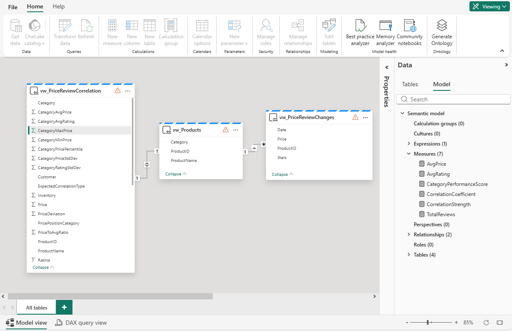
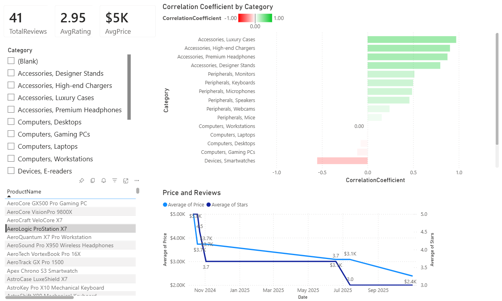

<!--
---
page_type: sample
languages:
- sql
products:
- fabric
- fabric-database-cosmos-db
name: |
    Lakehouse SQL Analytics with Power BI
urlFragment: price-reviews-powerbi
description: Analyze price-review correlations in Cosmos DB data using Fabric Lakehouse SQL views and Power BI dashboards.
---
-->

# 📊 Price-Review Correlation Analysis with Power BI

Analyze product pricing and customer satisfaction correlations using Cosmos DB, Fabric Lakehouse SQL views, and Power BI dashboards.

This sample demonstrates how to analyze Cosmos DB data in Microsoft Fabric using **lakehouse shortcuts** and **SQL views**, then build compelling **Power BI dashboards** to discover correlations between product pricing and customer review ratings. The analysis uses **category-relative pricing** to ensure meaningful comparisons by positioning products within their specific categories rather than using arbitrary price thresholds.

> **🎯 Key Innovation**: This sample uses **category-relative pricing analysis** instead of static price bands, ensuring meaningful comparisons by positioning products within their specific categories.

## 🎯 What You'll Learn

### 📈 Data Analytics Concepts

- **Price-review correlation analysis** across product categories
- **Statistical analysis** using SQL aggregation and DAX measures
- **Category-relative price analysis** avoiding arbitrary price band comparisons
- **Pearson correlation coefficient** calculation and interpretation

### 🔗 Fabric Integration Patterns

- **Cosmos DB shortcuts** to lakehouse for data access
- **SQL views** in Lakehouse SQL Analytics Endpoint
- **Semantic models** from lakehouse views
- **Power BI integration** with lakehouse data sources

### 📊 Business Intelligence

- **Interactive dashboards** showing price-satisfaction relationships
- **Category-based insights** for different product types
- **Performance metrics** and KPIs visualization
- **DAX measures** for correlation calculations

## 📋 Prerequisites

### Required Services

- **Microsoft Fabric workspace** with appropriate permissions
- **Cosmos DB artifact** in Fabric with sample data
- **Lakehouse** in your Fabric workspace
- **Power BI** access in your Fabric workspace

### Data Requirements

- **fabricSampleData.json** loaded in your Cosmos DB container
- **Lakehouse shortcuts** configured to your Cosmos DB container

### Skills

- Basic SQL query knowledge
- Familiarity with Power BI (helpful but not required)
- Understanding of data correlation concepts

## 📁 Sample Files

This sample includes the following files:

- **`view-correlation.sql`** - SQL view for price-review correlation analysis
- **`view-products.sql`** - SQL view for product dimension table
- **`view-price-review-changes.sql`** - SQL view for price/review changes over time
- **`README.md`** - This complete guide (you are here)

---

## 🚀 Step 1: Create Cosmos DB Container with Sample Data

Choose either Option A (recommended for quick start) or Option B (manual setup).

### Option A: Create from Cosmos Data Explorer (Recommended)

1. Open your **Cosmos DB artifact** in Microsoft Fabric
2. In the **Data Explorer**, go to the **Home** tab
3. Click **Get started with sample** or look for sample data options
4. Select **SampleData** to create a pre-populated container
5. The system will automatically create a database and container with sample product and review data
6. **Note the database name and container name** for later use

### **Option B: Manual Creation and Upload**

1. Create or open your **Cosmos DB artifact** in Fabric
2. Open **Cosmos DB Data Explorer**
3. Create a new container:
   - Database name: `CosmosSampleDatabase` (or your choice)
   - Container name: `SampleData` (or your choice)
   - Partition key: `/categoryName`
4. **Upload sample data:**
   - Click the **Upload** button in Data Explorer
   - Select `datasets/fabricSampleData.json` from this repository
   - Verify all documents loaded successfully

---

## 🚀 Step 2: Create Lakehouse and Shortcut to Cosmos DB

1. In your Fabric workspace, create a **new Lakehouse**
   - Name it clearly (e.g., `CosmosSampleLakehouse`)

2. **Create a shortcut to your Cosmos DB:**
   - In the lakehouse, go to **Tables** section
   - Click **New shortcut**
   - Select **Microsoft OneLake**
   - Choose your Cosmos DB database created in Step 1
   - Click **Create**

3. **Important:** Note these names for the SQL view configuration:
   - **Schema name:** Your Cosmos DB database name (e.g., `CosmosSampleDatabase`)
   - **Table name:** Your Cosmos DB container name (e.g., `SampleData`)

---

## 🚀 Step 3: Create SQL Views in Lakehouse

This sample includes **three SQL view files** that create optimized data structures for Power BI. You'll execute each one in your Lakehouse SQL Analytics Endpoint.

### SQL Views Overview

1. **`view-correlation.sql`** - Creates `vw_PriceReviewCorrelation`
   - Price-review correlation analysis with category-relative positioning
   - Statistical analysis fields (percentiles, ratios, value categories)
   - Optimized for correlation visualizations

2. **`view-products.sql`** - Creates `vw_Products`
   - Product dimension table for filtering and details
   - Used for slicers, drill-through, and detail cards

3. **`view-price-review-changes.sql`** - Creates `vw_PriceReviewChanges`
   - Tracks price and review score changes over time
   - Enables visualization of pricing decisions impact on satisfaction

### Execute the SQL Views

1. Open your **Lakehouse** in Fabric workspace
2. Click **SQL analytics endpoint** in the top-right corner
3. Click **New SQL query** button

**For each SQL file (`view-correlation.sql`, `view-products.sql`, `view-price-review-changes.sql`):**

1. Open the SQL file from this folder
2. Replace the placeholders throughout the script:
   - `{SCHEMA_NAME}` - Your Cosmos DB database name (e.g., `CosmosSampleDatabase`)
   - `{TABLE_NAME}` - Your container name (e.g., `SampleData`)
3. Copy the modified SQL and paste into the SQL query window
4. Click **Run** to execute
5. Verify the view was created successfully (you should see a success message)
6. Repeat for all three SQL files

**Verification:** After creating all three views, you should see them listed in your Lakehouse SQL Analytics Endpoint under the Views section.

---

## 🚀 Step 4: Create Semantic Model from Lakehouse

In Microsoft Fabric, you must create a semantic model from your views before you can use them in Power BI reports.

1. In your Fabric workspace, navigate to your **Lakehouse** (the main lakehouse item)
2. In the Lakehouse, click **New semantic model** button
3. Give your semantic model a meaningful name (e.g., `PriceReviewCorrelationModel`)
4. Select all three views:
   - ✅ `vw_PriceReviewCorrelation`
   - ✅ `vw_Products`
   - ✅ `vw_PriceReviewChanges`
5. Click **Confirm** to create the semantic model

**The semantic model will be created in your workspace.**

### Configure Column Properties for vw_PriceReviewChanges

Before creating relationships, configure the Price and Stars columns:

1. In the semantic model **Model view**, locate the `vw_PriceReviewChanges` table
2. **Configure Price column:**
   - Click on the `Price` column
   - In the **Properties** pane on the right, expand **Advanced**
   - Set **Summarize by:** `None`
   - Under **Formatting**, set **Format:** `Currency`
3. **Configure Stars column:**
   - Click on the `Stars` column
   - In the **Properties** pane, expand **Advanced**
   - Set **Summarize by:** `None`
   - Under **Formatting**, set **Format:** `Decimal number`
   - Set **Decimal places:** `2`
4. Click **Save** to save these changes

---

## 🚀 Step 5: Create Relationships in Semantic Model

Before creating measures, establish relationships between the views.

1. In your workspace, click on the **Semantic Model** you just created
2. This opens the **Model view**
3. Create relationships between views:
   - Drag from `vw_Products[ProductID]` to `vw_PriceReviewCorrelation[product_id]`
   - Cardinality: **One to One** (1:1)
   - Cross filter direction: **Single**
   - Drag from `vw_Products[ProductID]` to `vw_PriceReviewChanges[ProductID]`
   - Cardinality: **One to Many** (1:*)
   - Cross filter direction: **Single**

4. Click **Save** to save the model

---

## 🚀 Step 6: Create DAX Measures in Semantic Model

**IMPORTANT:** Create these 6 essential DAX measures in your semantic model before building visualizations. All measures are created in the semantic model editor.

### How to Create a DAX Measure

1. In your **Semantic Model** (still open from Step 5)
2. In the **Data pane** on the right, click the **⋮** (three dots) next to `vw_PriceReviewCorrelation`
3. Select **New measure**
4. A formula bar will appear at the top
5. **Delete everything** in the formula bar (including "Measure = ")
6. Paste the complete DAX code from below
7. Press **Enter** or click the **✓ checkmark** to save
8. The new measure appears in the Data pane with a calculator icon

**Your semantic model should look like this when done:**



---

### Measure 1: AvgPrice

**Purpose:** Shows typical price point for each category.

```dax
AvgPrice = 
AVERAGE(vw_PriceReviewCorrelation[Price])
```

**What this does:** Calculates the average price for products in the current filter context.

---

### Measure 2: AvgRating

**Purpose:** Shows overall customer satisfaction level.

```dax
AvgRating = 
AVERAGE(vw_PriceReviewCorrelation[Rating])
```

**What this does:** Calculates the average rating across all products in the current filter context.

---

### Measure 3: TotalReviews

**Purpose:** Provides context on sample size and statistical significance.

```dax
TotalReviews = 
COUNTROWS(vw_PriceReviewCorrelation)
```

**What this does:** Counts the total number of product-review records in the current filter context.

---

### Measure 4: CorrelationCoefficient

**Purpose:** Core measure showing the strength and direction of the price-rating relationship (Pearson's r).

```dax
CorrelationCoefficient = 
VAR CurrentCategory = SELECTEDVALUE(vw_PriceReviewCorrelation[Category])
VAR CategoryData = 
    FILTER(
        vw_PriceReviewCorrelation, 
        vw_PriceReviewCorrelation[Category] = CurrentCategory
    )
VAR SumXY = 
    SUMX(
        CategoryData, 
        vw_PriceReviewCorrelation[PriceDeviation] * vw_PriceReviewCorrelation[RatingDeviation]
    )
VAR SumX2 = 
    SUMX(
        CategoryData, 
        vw_PriceReviewCorrelation[PriceDeviation] * vw_PriceReviewCorrelation[PriceDeviation]
    )
VAR SumY2 = 
    SUMX(
        CategoryData, 
        vw_PriceReviewCorrelation[RatingDeviation] * vw_PriceReviewCorrelation[RatingDeviation]
    )
RETURN 
    IF(
        SumX2 = 0 || SumY2 = 0, 
        BLANK(), 
        SumXY / SQRT(SumX2 * SumY2)
    )
```

**What this does:** Calculates Pearson's correlation coefficient (r) between price and rating for each category. Values range from -1 to 1:

- **Positive values:** Higher prices correlate with higher ratings
- **Negative values:** Higher prices correlate with lower ratings
- **Near 0:** No correlation between price and rating

---

### Measure 5: CorrelationStrength

**Purpose:** Categorizes correlation as Strong/Moderate/Weak for easy filtering.

```dax
CorrelationStrength = 
VAR Corr = [CorrelationCoefficient]
RETURN 
    IF(
        ISBLANK(Corr), 
        "No Data",
        IF(
            ABS(Corr) >= 0.7, 
            "Strong",
            IF(
                ABS(Corr) >= 0.4, 
                "Moderate", 
                IF(
                    ABS(Corr) >= 0.2, 
                    "Weak", 
                    "Very Weak/None"
                )
            )
        )
    )
```

**What this does:** Converts the numeric correlation coefficient into categories:

- **Strong:** |r| ≥ 0.7 (clear price-quality relationship)
- **Moderate:** 0.4 ≤ |r| < 0.7 (noticeable relationship)
- **Weak:** 0.2 ≤ |r| < 0.4 (slight relationship)
- **Very Weak/None:** |r| < 0.2 (no meaningful relationship)

---

### Measure 6: CategoryPerformanceScore

**Purpose:** Combines correlation strength and customer satisfaction into a single metric.

```dax
CategoryPerformanceScore = 
VAR AvgRatingValue = [AvgRating]
VAR CorrelationScore = 
    IF(
        ABS([CorrelationCoefficient]) >= 0.6, 
        3, 
        IF(ABS([CorrelationCoefficient]) >= 0.3, 2, 1)
    )
VAR RatingScore = 
    IF(
        AvgRatingValue >= 4, 
        3, 
        IF(AvgRatingValue >= 3, 2, 1)
    )
RETURN 
    CorrelationScore + RatingScore
```

**What this does:** Creates a composite score (2-6) combining:

- **Correlation Score (1-3):** How predictable is the price-quality relationship?
- **Rating Score (1-3):** How satisfied are customers?
- **Score of 6:** Best categories - predictable pricing + high satisfaction
- **Score of 2-3:** Problem areas - needs attention

**✅ All 6 Measures Created!** Save your semantic model and proceed to create the Power BI report.

---

## 🚀 Step 7: Create Power BI Report

Now you'll create visualizations using the semantic model and DAX measures.


### Create a New Report

1. Go to your **Fabric workspace**
2. Click **New item** → **Report**
3. Select **Pick a published semantic model**
4. Choose the semantic model you created (e.g., `PriceReviewCorrelationModel`)
5. Click the **down arrow** on **Auto-create report** button
6. Select **Create blank report**

**You should now see:**

- Blank canvas in the center
- **Visualizations** pane on the right
- **Data** pane showing your views and measures
- **Filters** pane

---

## 📊 Step 8: Build Visualizations

**Your final report will look like this when complete:**



### Understanding Your Data

**View Columns** (for grouping, filtering, legends):

- `Category`, `ValueCategory`, `SatisfactionLevel`, `PricePositionCategory`
- `product_name`, `Price`, `Rating`, `ReviewYear`

**DAX Measures** (for calculations):

- `AvgPrice`, `AvgRating`, `TotalReviews`
- `CorrelationCoefficient`, `CorrelationStrength`, `CategoryPerformanceScore`

---

### Visualization 1: Key Metrics Cards

Create three card visuals at the *top* of your dashboard:

**Card 1: Total Reviews:**

1. Add a **Card** visual to the canvas
2. Drag `TotalReviews` measure to the **Fields** area
3. Position at top-left

**Card 2: Average Rating:**

1. Add a **Card** visual
2. Drag `AvgRating` measure to the **Fields** area
3. Position at top-center

**Card 3: Average Price:**

1. Add a **Card** visual
2. Drag `AvgPrice` measure to the **Fields** area
3. **Format as currency:**
   - Click the card visual
   - In **Visualizations** pane → **Format** button (paint roller icon)
   - **General** → **Data format** → **Format options** → **Currency**
4. Position at top-right

---

### Visualization 2: Correlation Coefficient by Category

**Purpose:** Shows which categories have strong price-quality relationships.

1. Add a **Clustered Bar Chart** to your canvas
2. **Y-axis:** Drag `Category` from `vw_PriceReviewCorrelation`
3. **X-axis:** Drag `CorrelationCoefficient` measure
4. **Format:**
   - Toggle **Data labels** On
5. **Add tooltips:**
   - Drag `CorrelationStrength`, `AvgRating`, `TotalReviews` to **Tooltips** area
6. **Conditional formatting:**
   - Select the bar chart visual
   - **Format** button → **Bars** → **Colors** → **fx** button
   - Select **Gradient**
   - **What field should we base this on?** → `CorrelationCoefficient`
   - **Minimum:** Custom `-1`, Color: Red
   - **Center:** Custom `0`, Color: White
   - **Maximum:** Custom `1`, Color: Green
   - Click **OK**

---

### Visualization 3: Product Selector Table

**Purpose:** Select a product to view its price and review trends over time.

1. Add a **Table** visual
2. **Columns** (add in this order):
   - `ProductName` from `vw_Products`
   - `ProductID` from `vw_Products`
3. **Enable single selection:**
   - This table will act as a filter for the next visualization
   - Click on a product row to see its trend data in Visualization 4

---

### Visualization 4: Price & Review Changes Over Time

**Purpose:** Shows relationship between pricing decisions and customer satisfaction trends for the selected product.

1. Add a **Line Chart**
2. **X-axis:** `Date` from `vw_PriceReviewChanges`
3. **Y-axis:** `Price` from `vw_PriceReviewChanges`
4. **Secondary Y-axis:** `Stars` from `vw_PriceReviewChanges`
5. **Format:**
   - Enable **Dual Y-axis** to show both price and rating scales
   - Left Y-axis: Price ($)
   - Right Y-axis: Stars (1-5)
6. **Interaction:** This chart will automatically filter based on the product selected in Visualization 3

---

## 🔍 Interpreting the Results

### Correlation Coefficient Values

- **r > 0.6:** Strong positive correlation (higher price = higher ratings)
  - *Expected for:* Accessories
- **0.3 ≤ r ≤ 0.6:** Moderate positive correlation
  - *Expected for:* Peripherals
- **|r| < 0.2:** Weak or no correlation (price doesn't predict quality)
  - *Expected for:* Computers
- **r < -0.3:** Inverse correlation (higher price = lower ratings)
  - *Expected for:* Devices

### Key Insights to Look For

1. **Accessories:** Premium pricing justified by quality
2. **Devices:** Price resistance - customers expect value
3. **Computers:** Brand/features matter more than price
4. **Peripherals:** Some price-quality relationship exists

---

## 🔄 Sharing Your Report

### Option 1: Publish to Workspace

1. Click **File** → **Save**
2. Give your report a name (e.g., "Price-Review Correlation Analysis")
3. It automatically saves to your Fabric workspace
4. Click **Share** to give others access

### Option 2: Export to PowerPoint

1. Click **File** → **Export** → **PowerPoint**
2. Choose current page or all pages
3. Download the generated presentation

### Option 3: Subscribe for Email Updates

1. Click **Subscribe** in the top menu
2. Set frequency (daily/weekly)
3. Add recipients
4. Get automated reports in your inbox

---

## 🚨 Troubleshooting

### Semantic Model Issues

**Views not appearing in semantic model:**

- Verify all three views were created successfully in the Lakehouse SQL Analytics Endpoint
- Run `SELECT * FROM vw_PriceReviewCorrelation` to test the view
- Refresh the semantic model: Right-click the semantic model → **Refresh now**

**Relationships not creating correctly:**

- Ensure `ProductID` exists in all three views
- Check that column names match exactly (case-sensitive)
- Verify `product_id` in `vw_PriceReviewCorrelation` matches `ProductID` in `vw_Products`

### Visualization Issues

**Correlation Coefficient shows blank:**

- Ensure you have a `Category` filter or slicer active
- Verify `PriceDeviation` and `RatingDeviation` columns contain values in `vw_PriceReviewCorrelation`
- Check that you're not filtering out all data with other filters

**Product Selector Table (Visualization 3) not filtering the line chart:**

- Verify the relationship exists between `vw_Products` and `vw_PriceReviewChanges`
- Check interaction settings: Click the table visual → **Format** → **Edit interactions**
- Ensure the line chart is set to be filtered (not highlighted or none)

**Price & Review Changes line chart shows no data:**

- Select a product in Visualization 3 (Product Selector Table)
- Verify `vw_PriceReviewChanges` has data: Run `SELECT * FROM vw_PriceReviewChanges`
- Check that `ProductID` relationships are working correctly

**Dual Y-axis not showing correctly:**

- Ensure you added `Price` to Y-axis and `Stars` to Secondary Y-axis (not both to same axis)
- Verify column formatting was set in Step 4 (Price as Currency, Stars as Decimal)
- Check that **Summarize by** is set to `None` for both columns

### Data Issues

**Missing or incomplete data in visualizations:**

- Verify sample data was loaded: Check Cosmos DB Data Explorer
- Confirm lakehouse shortcut is working: View tables in Lakehouse
- Re-run the SQL view scripts if data appears incorrect

**Formatting issues (currency, decimals):**

- Return to semantic model and verify column properties in `vw_PriceReviewChanges`
- Ensure `Price` is set to Currency format
- Ensure `Stars` is set to Decimal with 2 decimal places
- Save the semantic model after making changes

---

## 📚 Additional Resources

- [Fabric Lakehouse Documentation](https://learn.microsoft.com/fabric/data-engineering/lakehouse-overview)
- [Cosmos DB in Fabric Documentation](https://learn.microsoft.com/fabric/database/cosmos-db/)
- [Power BI in Fabric](https://learn.microsoft.com/power-bi/)
- [Power Query](https://learn.microsoft.com/power-bi/transform-model/desktop-query-overview)
- [Understanding Pearson Correlation](https://en.wikipedia.org/wiki/Pearson_correlation_coefficient)

---

## ✅ Quick Reference Checklist

- [ ] Step 1: Create Cosmos DB container with sample data
- [ ] Step 2: Create Lakehouse and shortcut to Cosmos DB
- [ ] Step 3: Execute all three SQL view files
- [ ] Step 4: Create Semantic Model from Lakehouse
- [ ] Step 5: Create relationships in Semantic Model
- [ ] Step 6: Create 6 DAX measures
- [ ] Step 7: Create Power BI report
- [ ] Step 8: Build 4 visualizations
- [ ] Share with stakeholders

---

*This sample demonstrates modern data analytics patterns in Microsoft Fabric, bridging operational Cosmos DB data with advanced SQL views, semantic models, and Power BI business intelligence.*
